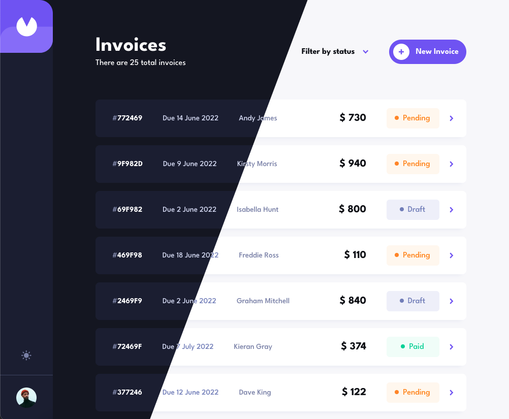

# Interactive comments section

This is a solution to the [Invoice app challenge on Frontend Mentor](https://www.frontendmentor.io/challenges/invoice-app-i7KaLTQjl).

## Table of contents

- [Overview](#overview)
  - [Functionality](#functionality)
  - [Screenshot](#screenshot)
  - [Link](#link)
- [My process](#my-process)
  - [Built with](#built-with)
  - [What I learned](#what-i-learned)
- [Author](#author)

## Overview

Responsive CRUD-Invoice app

### Functionality

Users are able to:

- View the optimal layout for the app depending on their device's screen size
- See hover states for all interactive elements on the page
- Create, read, update, and delete invoices
- Save draft invoices, and mark pending invoices as paid
- Filter invoices by status (draft/pending/paid)
- Toggle light and dark mode
- Scrolling page and loading more invoices

### Screenshot

### Link

- Live Site URL: [Demo](https://wasatad.github.io/Invoice-App/)
- Walk-through Video: [Watch](https://www.youtube.com/watch?v=U4Oa5ENp-fY)

## My process

### Built with

- [Vue.js](https://vuejs.org/) - JS framework
- [Vuex.js](https://vuex.vuejs.org/) - State manager
- [Firebase](https://firebase.google.com/) - Firestore database
- [Vue 3 Datepicker](https://vue3datepicker.com/) - Datepicker Vue component
- [SCSS](https://sass-lang.com/) - CSS pre-processor

### What I learned

I learned a lot of things, such a data exchange with real database, implementing infinite scroll from Intersection Observer, validating time data and dynamic switching dark/light theme. It was a great experience and a pretty hard challenge.

## Author

- Frontend Mentor - [@Wasatad](https://www.frontendmentor.io/profile/Wasatad)
- Telegram - [@kuznetsovtm](https://t.me/@kuznetsovtm)
